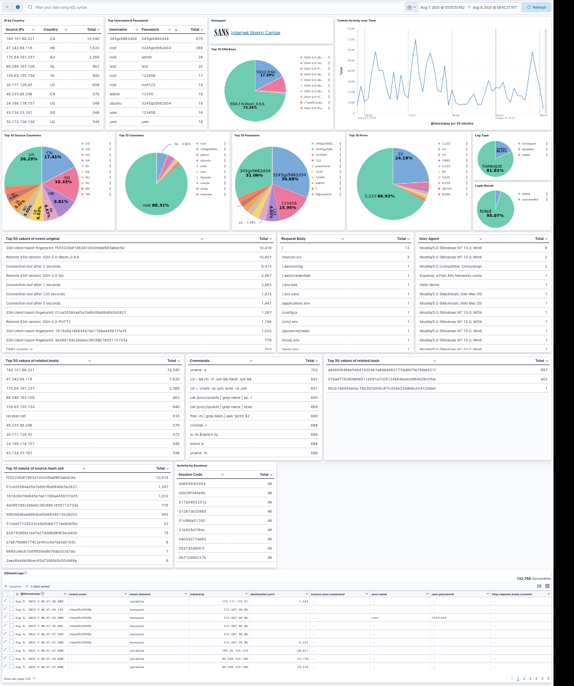

# DShield-ELK
## ​DShield monitoring with a Docker ELK stack

Using an ELK(**e**lasticsearch **l**ogstash **k**ibana) or Elastic Stack is a great way to get a high level view of what is being seen with your [DShield](https://isc.sans.edu/tools/honeypot/)[^1] honeypot.

For those that don't have a dedicated ELK stack already or are just looking for a way to monitor your honeypot from a separate device (in my case, I didn't want to put more holes in my internal firewall), follow this step-by-step guide to get up and running quickly.

First of we need to get logs from the honeypot configured to use an ELK beat, if you want a great guide on collecting all the logs see this [diary](https://isc.sans.edu/diary/Install+Configure+Filebeat+on+Raspberry+Pi+ARM64+to+Parse+DShield+Sensor+Logs/30056)[^2] posted on the ISC page.

This is an ELK (Elasticsearch Logstash Kibana) stack that is setup to monitor logs from a [DShield](https://dshield.org/)[^1] honeypot.

It is put together using the [Getting started with the Elastic Stack and Docker-Compose](https://github.com/elkninja/elastic-stack-docker-part-one)[^3] project and the [Install & Configure Filebeat on Raspberry Pi ARM64 to Parse DShield Sensor Logs](https://isc.sans.edu/diary/Install+Configure+Filebeat+on+Raspberry+Pi+ARM64+to+Parse+DShield+Sensor+Logs/30056)[^2] diary. The only change is to edit the **filebeat.yml** to send to the ip address of the device you intend to run [**Dshield-ELK**](https://github.com/fkadriver/Dshield-ELK)[^4] on.

###Usage
[**Dshield-ELK**](https://github.com/fkadriver/Dshield-ELK)[^4]assumes the following prior to starting:
- a running [DShield Honeypot](https://www.dshield.org/tools/honeypot/)[^1]
- Docker (tested on Ubuntu 20.04.6 LTS running Docker version 24.0.5, but this should work on any platform)
- Have setup filebeats per [Install & Configure Filebeat on Raspberry Pi ARM64 to Parse DShield Sensor Logs](https://isc.sans.edu/diary/Install+Configure+Filebeat+on+Raspberry+Pi+ARM64+to+Parse+DShield+Sensor+Logs/30056)[^2] up to the **Setup Logstash Collection & Parsing**
- Confirm **tcp port 5044** can get to the host. This port will not be up to start, but is brought up during the following docker compose.

**Steps to configure:**
1. Complete the setup of filebeat [Install & Configure Filebeat on Raspberry Pi ARM64 to Parse DShield Sensor Logs](https://isc.sans.edu/diary/Install+Configure+Filebeat+on+Raspberry+Pi+ARM64+to+Parse+DShield+Sensor+Logs/30056)[^2] up to the **Setup Logstash Collection & Parsing**
1. Clone [**Dshield-ELK**](https://github.com/fkadriver/Dshield-ELK)[^4] to a local directory.
      - `git clone https://github.com/fkadriver/Dshield-ELK.git `
1. Change to to the **DShield-ELK** directory
      - `cd DShield-ELK`
2. Change any environment variables in [.env](.env)
    - Any editor can be used, but recommend using nano if you are not familiar with something else.
    - `nano .env` (note the '.' at the front of **.env**)
    - Recommend changing at least:
        - **ELASTIC\_PASSWORD** is the password that is used for administrative access to both Elastic and Kibana
        - **KIBANA\_PASSWORD** is only used as the internal password for Kibana to communicate to Elastic
    - Optional
        - **STACK\_VERSION**  **is the version of elastic used in this stack. The build has been tested with**  **8.8.2**  **but any version should work**
        - **DNS_SERVER** Is a list of DNS Sever(s) used in the filters. The default setup in each filter is to use what ever dns settings that are defined on the host.If you want to use specific DNS server(s) you need to change the **DNS_SERVER** variable and un-comment the **# nameserver** lines in the following files:
            - logstash-200-filter-cowrie.conf: line 115
            - logstash-202-filter-cowrie-sqlite.conf: line 284
            - logstash-300-filter-iptables.conf: line 63
        - Memory Limits are the most memory that docker will allocate for each of the ELK containers.  Default to **1073741824** (1GB) but can be expanded if you have the resources
          - ES_MEM_LIMIT: Elastic Memory 
          - KB_MEM_LIMIT: Kibana Memory
          - LS_MEM_LIMIT: Logstash memory
1. Save the **.env** file to the same location
    - if using nano, **^o** and then **^x**
3. Once the project and any setting changes (if applicable) have been completed, it is time to bring up the stack. This will take a few minutes especially if you have not previously pulled the elastic images previously.
    - `docker compose up -d` (the **-d** is optional, but without it, when you close the prompt or stop the command the container will shut down). See [Overview of docker compose CLI](https://docs.docker.com/compose/reference/)[^5] for more information about the docker compose cmd
1. Open a browser and confirm that the following ports are your host:
    - **5601** : Kibana
        - User: elastic
        - Password: **${ELASTIC\_PASSWORD}**
        - [https://localhost:5601](https://localhost:5601)
    - **9200** : Elastic
        - User: elastic
        - Password: **${ELASTIC\_PASSWORD}**
        - Since version 8, the connection to ES is secured with a self signed cert, so you will have to use [**https://localhost:9200**](https://localhost:9200/). (You might be prompted to use an insecure or self-signed certificate.  This is normal)
1. Logstash will also be running on port 5044
    - **5044** : Logstash
        - This is setup to receive any beats input, but only has filters and output for **cowrie\*** logs from the [diary](https://isc.sans.edu/diary/Install+Configure+Filebeat+on+Raspberry+Pi+ARM64+to+Parse+DShield+Sensor+Logs/30056)[^2].
        - Additional filters can be added to the [logstash/pipeline](logstash/pipeline) directory.
2. Connect to Kibana on port 5601 ([**http://localhost:5601**](http://localhost:5601/) ) using the user **elastic** and the password **{ELASTIC\_PASSWORD}** from the [.env](.env) file.
3. If everything worked, you should be able to open **[Logs DShield Sensor] Overview** dashboard
4. Here is a snip of my dashboard over the past 24 hours
5. You can change the order of any column, mousing over an item lets you filter in or out that item from the entire dashboard.
6. Don't forget to look at the raw logs (bottom of the dashboard) for details that might not be parsed into the pretty graphs.

**Things to remember:**
- This will only collect logs from the honeypot while it is running
- Since the honeypot is running **filebeat** , it will cache logs for a period. When you first start this stack it will take the cached logs from the honeypot as fast as it can ingest them.
- For more information about the dashboard see the end of the [diary](https://isc.sans.edu/diary/Install+Configure+Filebeat+on+Raspberry+Pi+ARM64+to+Parse+DShield+Sensor+Logs/30056)[^2].

**Issues and troubleshooting:**
- No logs are showing up in Kibana/Elastic
  - Confirm filebeat is running on the honeypot.
  - Confirm that Logstash is running in the docker container.
  - Confirm that you can connect to port 5044 from the honeypot
  - Look for filebeat errors on the sensor
    - `sudo grep filebeat /var/log/syslog|egrep -i 'error|warn'`
- Logstash starts and then dies
  - Look at the logs of the container `docker logs dshield-elk-logstash01-1` for errors. The errors I have seen are usually about permissions on the file logstash.yml
- Docker gives error about not enough permissions
  - Run docker with sudo privileges `sudo docker ...`
  - Run docker in [Rootless](https://docs.docker.com/engine/security/rootless/) mode[^6]

[^1]:[https://isc.sans.edu/tools/honeypot/](https://isc.sans.edu/tools/honeypot/)
[^2]:[https://isc.sans.edu/diary/Install+Configure+Filebeat+on+Raspberry+Pi+ARM64+to+Parse+DShield+Sensor+Logs/30056](https://isc.sans.edu/diary/Install+Configure+Filebeat+on+Raspberry+Pi+ARM64+to+Parse+DShield+Sensor+Logs/30056)
[^3]:https://isc.sans.edu/diary/Install+Configure+Filebeat+on+Raspberry+Pi+ARM64+to+Parse+DShield+Sensor+Logs/30056
[^4]:[https://github.com/fkadriver/Dshield-ELK](https://github.com/fkadriver/Dshield-ELK)
[^5]:https://docs.docker.com/compose/reference/
[^6]:https://docs.docker.com/engine/security/rootless/
